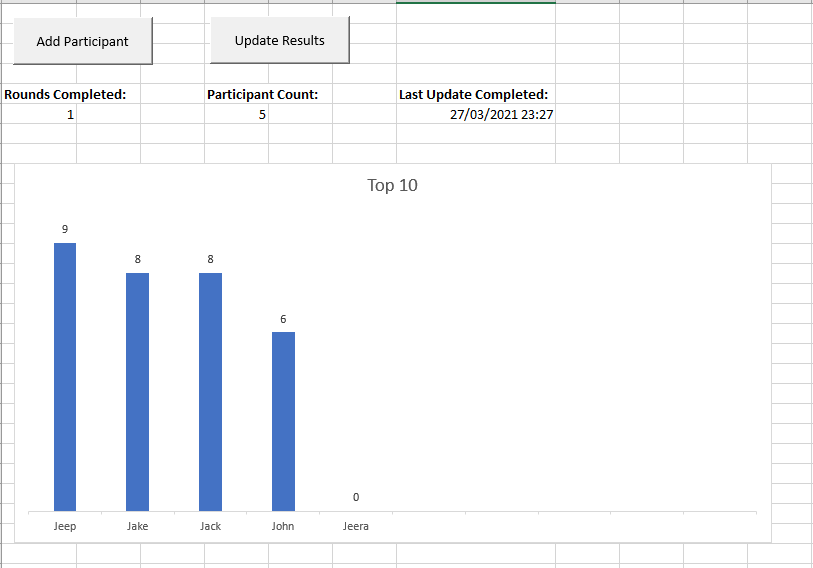

<h1>Footy Tipping</h1>

The aim of this project was to create an Excel spreadsheet that would facilitate a footy tipping competition. The rules for this competition were that each participant would submit all of their tips for the entire AFL season before the season commences. A group of people were to enter these tips manually into the spreadsheet. After each round, the facilitator of the competition would update the master spreadsheet and produce a cumulative leaderboard for that round.

I decided to structure my spreadsheet around the three sheets below:

<h4>A primary sheet</h4>

<h4>A sheet to store the scores and tips of participants</h4>

<h4>A sheet to store the fixtures and results of each AFL round</h4>

