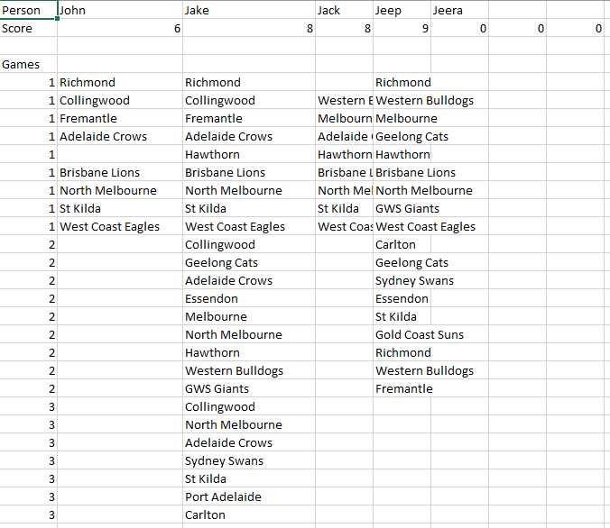
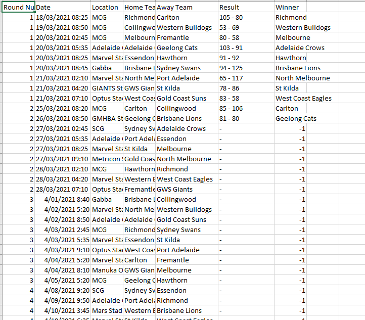

<h1>Footy Tipping</h1>

The aim of this project was to create an Excel spreadsheet that would facilitate a footy tipping competition. The rules for this competition were that each participant would submit all of their tips for the entire AFL season before the season commences. A group of people were to enter these tips manually into the spreadsheet. After each round, the facilitator of the competition would update the master spreadsheet and produce a cumulative leaderboard for that round.

I decided to structure my spreadsheet around the three sheets below:

<h4>A primary sheet</h4>

<h4>A sheet to store the scores and tips of participants</h4>

<h4>A sheet to store the fixtures and results of each AFL round</h4>

***

When the user clicks on the 'Add Participant' button (Sub enter_your_tips runs from the main module), they are first prompted to enter the name of the person they are entering tips for before being met with the following VBA userform. This userform is populated with dropdowns for each of the games of that corresponding round (this occurs when the userform initializes), which ensures that data entry is free from errors. When the user clicks 'Next', these tips are entered into the data sheet.

Finally, when the user clicks on the 'Update Results' button, the Sub update_fixture_results runs from the main module. This accesses the internet and locates a website where AFL results are stored and then scrapes data from a table on this website. It then uses this to update the fixtures sheet and this in turn updates the top 10 graph on the primary sheet. So to summarise, when the facilitor of the footy tipping competition uses this spreadsheet, from week to week, all they have to do is click the 'Update Results' button and all the work is done for them.
