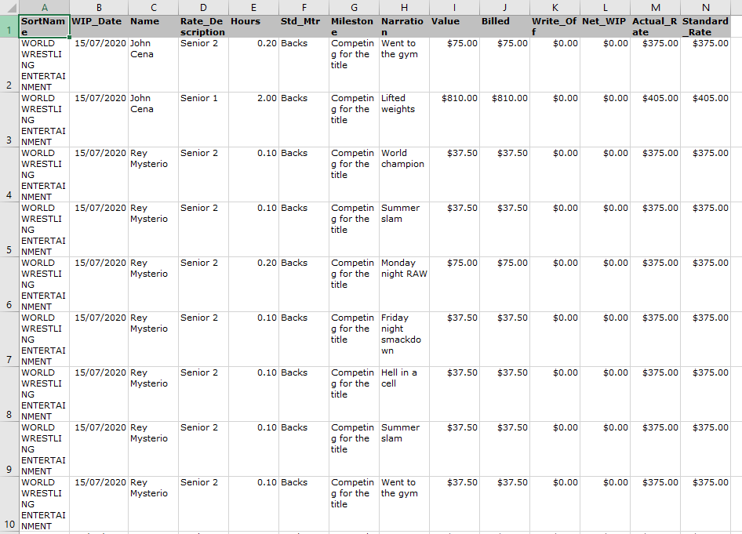
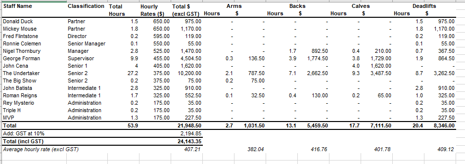

<h1>Work In Progress Table</h1>

The scenario for this project is that you are a professional services firm and all of your staff keep detailed logs of their time. When getting paid by clients, you need to concisely show the time spent on that particular client and where specifically the time was spent.

<h2>A spreadsheet of time entries like this:</h2>

<i>
Note:
<ul>
  <li>Column 1 is the client</li>
  <li>Column 3 is the name of the person who made the time entry</li>
  <li>Column 4 is that person's position at your firm</li>
  <li>Column 5 is the number of hours they have spent on the time entry</li>
  <li>Column J is the value of that time entry that will be charged to the client</li>
  <li>The final two columns show the person's hourly charge out rate</li>
</ul>
</i>

<h2>Needs to be converted to a table like this:</h2>

What is occurring here is that each combination of person and hourly rate is being consolidated and added together for each category. The category names themselves need to be sorted in ascending order and people need to be sorted in descending order based on who has the single highest hourly rate. I have used arrays extensively in this project to help it run quicker.

This is in theory a relatively simple exercise, except that VBA does not have great support for arrays as far as built in functions go and so I had to create a lot of functions to help me. In the 'Common' module, there is a quicksort algorithm function that can sort a single array in ascending or descending order, a quicksort function that can sort mutli dimmensional arrays, a function to add a new element to an array, and functions to return the location of an element in an array.

The script for the process is contained in the 'Main' module.

To distribute this project, I created an Excel Add-In using a template from here: https://www.thespreadsheetguru.com/myfirstaddin and pasted it here: C:\Users\[*Username*]\AppData\Roaming\Microsoft\Excel\XLSTART.
